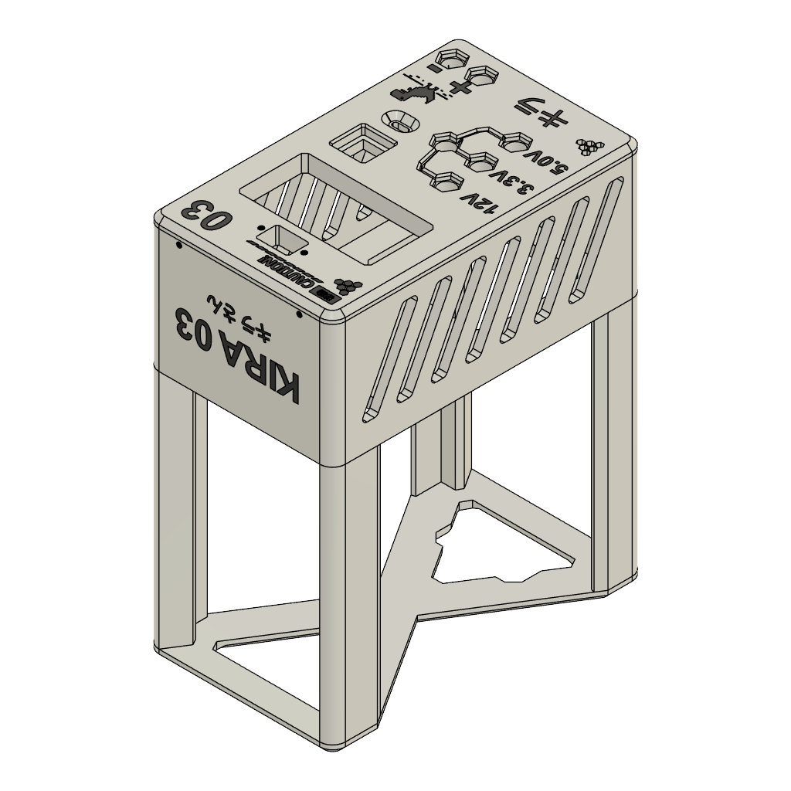

# Benchy — Kira 03 Bench Power Supply

A compact desktop power-supply project with a distinctive white enclosure, black panels, and a front-mounted display and controls. The goal of this project is to make the design understandable, reproducible, and easy for other makers to improve.

I added pixel-art details to give the enclosure a distinctive, friendly identity. I wanted Benchy to be visually engaging as well as useful, rather than another plain workshop instrument.

**Documentation status: pre-release draft, 10 September 2026.** This package includes the creator-supplied enclosure 3MF, a creator-confirmed preliminary parts list, a preliminary connection schematic, a Nano-to-relay bench-test sketch and diagram, and a review of 40 exterior photos. Exact as-built control integration, complete procurement details, internal wiring photos, and test results are still needed. It is not yet a complete or validated construction release. Do not infer electrical connections or operating limits from the photographs.

**Project name:** Benchy. **Project identifier:** Kira 03. The original Drive folder retains its earlier Kira 04 label; the public name is confirmed as Benchy — Kira 03.

## Motivation

Desktop computers have become more power-hungry, so a power supply that was adequate ten years ago may no longer meet the demands of a modern computer. That does not mean the old unit has stopped working or has become useless. Rather than discard functional hardware, I repurposed it as the basis of a bench power supply. Benchy extends the useful life of the original supply and turns it into a practical source of power for electronics work, prototyping, and testing.

[View the recommended cover photo — IMG_1258](https://drive.google.com/file/d/1YJo52oygfjsBpoJOT1S7QtzgaYJUblWP/view?usp=drivesdk)

## Start here

| Document | Purpose |
|---|---|
| [Project and build guide](docs/BUILD_GUIDE.md) | Design overview, information required to build, assembly stages, commissioning, operation, and troubleshooting |
| [Printable assembly guide](docs/Benchy_Kira_03_Assembly_Guide.pdf) | MakerWorld-ready mechanical assembly sequence, checklists, and electrical completion gate |
| [Parts list](docs/PARTS_LIST.md) | Creator-confirmed components and remaining sourcing details |
| [Enclosure model](mechanical/README.md) | Included 3MF, embedded preview, inspection and printing notes |
| [Connection schematic](hardware/CONNECTION_SCHEMATIC.md) | Preliminary module-level wiring map, connection table, and confirmation checklist |
| [Nano and relay](docs/NANO_AND_RELAY.md) | Compilable relay-module bench test, reference pin map, upload steps, and final integration requirements |
| [Arduino firmware](firmware/README.md) | Nano sketch, low-energy test connections, configuration, and validation procedure |
| [Photo selection](docs/PHOTO_SELECTION.md) | Selected images, captions, alt text, and missing instructional shots |
| [YouTube production kit](docs/YOUTUBE.md) | Story, narration draft, shot list, chapters, and description |
| [Public launch plan](docs/PUBLISHING.md) | Recommended platforms and a practical launch sequence |
| [Release checklist](docs/RELEASE_CHECKLIST.md) | Concrete requirements for a reproducible public release |
| [Open-source licensing](docs/LICENSING.md) | Adopted CERN-OHL-S-2.0 terms and third-party attribution scope |
| [Contributing](CONTRIBUTING.md) | How to report problems and contribute improvements |
| Project review brief: [Word](docs/Benchy_Kira_03_Project_Review_Brief.docx) · [fillable PDF](docs/Benchy_Kira_03_Project_Review_Brief.pdf) | Project rationale, current engineering status, and feedback form for a professor or publication reviewer |

## What the photos establish

- White outer frame with dark side and top panels and ventilation openings.
- Front display module with a rotary knob and buttons.
- Front labels reading 12V, 3.3V, and 5.0V; these are photographed labels, not measured specifications.
- Additional front connectors, including a yellow connector above the display and a lower pair marked + and −.
- Rear inlet, switch, and perforated ventilation area.

The creator confirms PLA, M2/M3 screws, an SK120, a reused computer PSU, an Arduino Nano, and a relay. Exact module variants, circuit topology, output isolation, maximum current, total power, and protection behavior remain unverified. The yellow question-mark control's electrical function is also unverified.

## What will be in the build release

The intended release will contain editable hardware and enclosure source files, fabrication exports, an exact parts list with alternatives, a connector-level wiring schedule, assembly photographs, test results, and any required firmware and build instructions. A second person should be able to build it using the release alone.

## Electrical safety

The rear photo shows a mains-style inlet. Treat the design as mains-powered unless the creator confirms otherwise. This draft is not authorization to assemble or energize it. A qualified person must establish the input protection, insulation, accessible-metal protection, enclosure suitability, and safe commissioning procedure for the actual design. Never open or service a powered unit, and do not treat a dark display as proof that hazardous voltage is absent.

## License and availability

Copyright © 2026 Erdene Batbayar. The original hardware design source, enclosure files, connection schematic, and repository documentation are licensed under the [CERN Open Hardware Licence Version 2 — Strongly Reciprocal](LICENSE). This permits community use and improvement under reciprocal open-source terms while the creator retains copyright. Third-party material retains its own terms. See [LICENSING.md](docs/LICENSING.md) for the scope.

The [photo gallery](https://drive.google.com/drive/folders/1a5vY3R4KkWWrwnvo-AKPjcpfRcpAucLN) is public: anyone with the link can view it. Selected originals are linked in the photo guide; public viewing does not by itself grant reuse rights.

This public repository contains the documentation draft, enclosure model, and a preliminary connection schematic. A validated build release is still in preparation.
