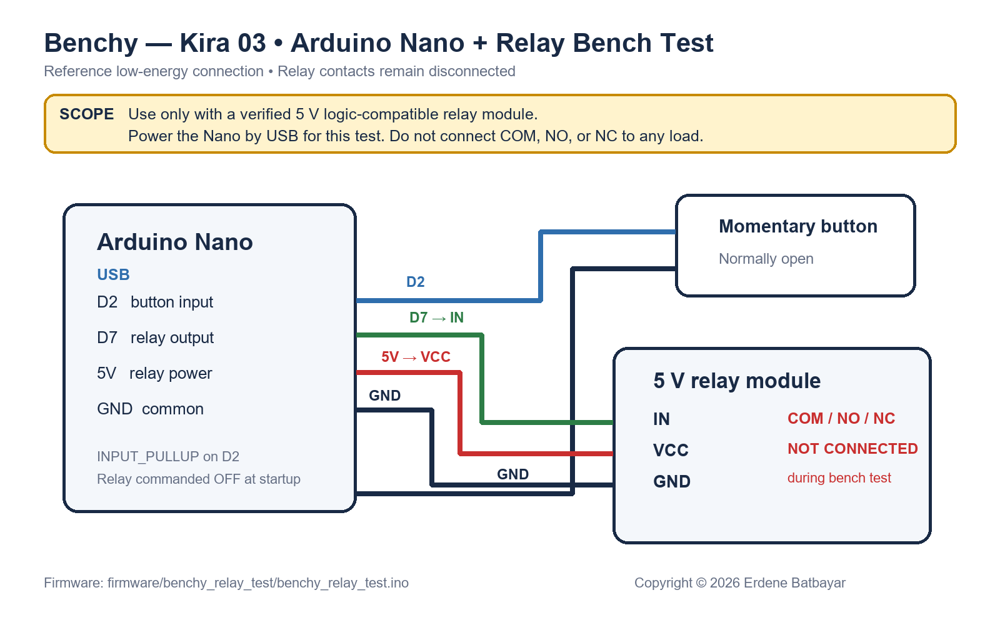

# Arduino Nano and relay documentation

The creator confirms that KIRA uses an Arduino Nano and a relay. A compilable [relay-module bench-test sketch](../firmware/benchy_relay_test/benchy_relay_test.ino) and the low-energy reference connection below are now included. They test the user-input and relay-control logic without connecting the relay contacts to the power supply.

## Reference test pin map

| Nano connection | Other endpoint | Defined behavior |
|---|---|---|
| `D2` | Momentary pushbutton, with the other terminal connected to Nano `GND` | Uses `INPUT_PULLUP`; a press reads low and toggles the requested relay state |
| `D7` | Verified relay-module `IN` | Logic output; active-low by default in the sketch and configurable after the module is identified |
| `5V` | Verified 5 V relay-module `VCC` | Relay-module supply during a USB-powered bench test only |
| `GND` | Relay-module `GND` and pushbutton return | Shared low-voltage reference |
| USB | Computer or USB supply | Nano power, sketch upload, and 9600-baud status output |

Keep relay `COM`, `NO`, and `NC` disconnected for this test. A bare relay coil must not be connected directly to `D7`; it requires a suitable driver and flyback suppression.

## Included source package

- `firmware/benchy_relay_test/benchy_relay_test.ino`
- Button input on `D2` with software debounce.
- Relay control output on `D7`.
- Relay commanded off in `setup()` before normal operation.
- Built-in LED and Serial Monitor status indication.
- Configurable `RELAY_ACTIVE_LOW` constant.

## Information still required for final integration

- Exact Nano board/processor/bootloader choice, including clone details where applicable.
- Arduino board package and library versions.
- Build/upload instructions and expected normal behavior.
- A complete pin table covering Nano power, ground, relay control, switches, and other connected inputs/outputs.
- Relay part number or module model, drive requirements, contact assignments, and load ratings.

## Final behavior to document

Explain what the Nano does and what the relay switches. Record the intended state when input power first arrives, while the Nano resets, during sketch upload, when USB is connected or removed, and if firmware stops running. Clarify active-high versus active-low control and how the circuit establishes its safe startup state.

The reference code defines a button-controlled relay-module test. It does not establish whether the completed project uses the relay for PSU enable, an output, or another function. Verify the driver and suppression arrangement against the actual components.

## Validation record

Test the control logic using a suitable low-energy setup before integrating it with the power path. Verify the observed states against the defined behavior. Then repeat the relevant checks in the completed reviewed assembly. Record unexpected resets, relay chatter, or output state changes as release-blocking problems until understood.

After the exact relay module and intended switched circuit are confirmed, update the diagram and sketch configuration, add a compatible hardware bias that holds the relay inactive while the Nano pin is high impedance, and repeat the startup/reset/failure tests.
