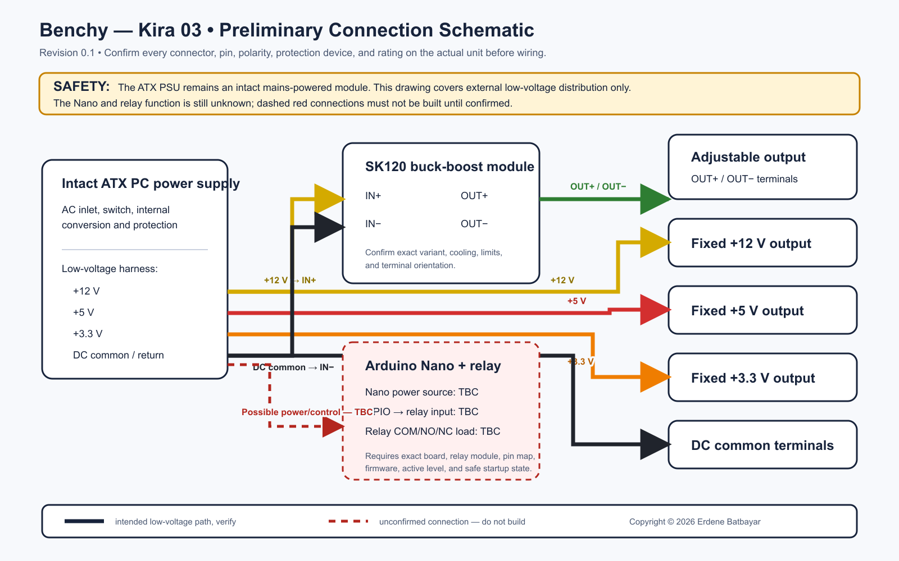

# Benchy — Kira 03 connection schematic

**Status:** preliminary connection map, revision 0.1 (2026-09-10).
**Do not build or energize from this drawing yet.** The exterior photographs do not show the internal wiring, and the exact PSU, Nano, and relay connections have not been supplied. Solid connections below describe the intended low-voltage architecture; every endpoint must be checked against the actual hardware. Dashed connections are explicitly unconfirmed.

[Open the scalable SVG version](connection-schematic.svg)

## Electrical connections

| Net | From | To | Status and verification |
|---|---|---|---|
| +12 V DC | Donor PSU +12 V rail | 12 V fixed-output positive terminal | Intended; confirm the PSU connector pin and rail rating from its label/manual, then meter it before connection. |
| +12 V DC | Donor PSU +12 V rail | SK120 `IN+` | Intended; confirm the installed SK120 variant and its allowed input range. Add branch protection sized for the wiring and module. |
| DC common | Donor PSU return | Fixed-output negative/common terminals and SK120 `IN-` | Intended common return; verify that the finished unit is actually wired this way. |
| +5 V DC | Donor PSU +5 V rail | 5 V fixed-output positive terminal | Intended; confirm pin and available current. |
| +3.3 V DC | Donor PSU +3.3 V rail | 3.3 V fixed-output positive terminal | Intended; confirm pin and available current. |
| Adjustable + | SK120 `OUT+` | Adjustable-output positive terminal | Intended; confirm the exact terminal pair and polarity. |
| Adjustable − | SK120 `OUT-` | Adjustable-output negative terminal | Intended; confirm the exact terminal pair and polarity. |
| Nano supply | Regulated +5 V and DC common | Nano `5V` and `GND` | **TBC:** confirm whether the Nano is powered from the PSU's 5 V rail, USB, or another regulator. Never apply PSU power to `VIN` unless the chosen board's requirements are met. |
| Relay input | Nano GPIO, +5 V, and GND | Relay module `IN`, `VCC`, and `GND` | **TBC:** record the exact GPIO, active level, and relay-module type. A bare relay requires a driver and flyback suppression. |
| Relay contacts | Relay `COM` and `NO`/`NC` | Switched circuit | **TBC:** the relay's purpose has not been confirmed. Do not connect its contacts until the switched circuit and ratings are documented. |
| PSU enable | PSU `PS_ON#` and DC common | Switch or reviewed control circuit | **TBC:** verify the donor PSU documentation. Do not identify this conductor by color alone, especially on modular PSU sockets. |

## Connector orientation and wire identification

The final release must name the exact donor PSU and show every connector from a stated viewing direction. Use connector positions and pin numbers as the primary identifiers. Wire colors may be recorded as a secondary check, but they are not sufficient by themselves. The PSU-side pinout of a modular cable is not universal.

For the commonly used ATX motherboard harness, the expected rail colors are often yellow for +12 V, red for +5 V, orange for +3.3 V, black for DC common, and green for `PS_ON#`. Treat that as a clue only. Confirm the actual supply from manufacturer information and measurements with the unit safely disconnected from the project.

## Information needed to finalize revision 1.0

1. Donor PSU manufacturer, exact model, label photograph, and the connector used for each rail.
2. Clear internal photographs showing both ends of every conductor.
3. Installed SK120 terminal labels and module revision.
4. Arduino Nano power pins, input/output pins, and source code.
5. Relay module model, coil or input voltage, active level, contact selection, and the circuit it switches.
6. Output connector names, polarity, conductor gauge, fuses, and current limits.
7. Confirmation of the relationship between DC common, chassis, and protective earth.

## Safety boundary

Keep the computer PSU as an enclosed, intact, approved module. This schematic does not document or authorize changes inside its mains-voltage section. A competent reviewer must check input protection, protective earth, insulation, strain relief, branch protection, conductor sizing, ventilation, and the completed wiring before first power-up.
